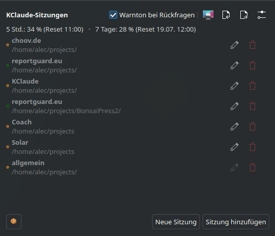
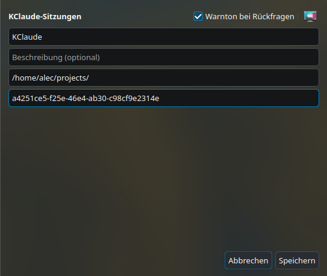

<div align="center">
  <picture>
    <source media="(prefers-color-scheme: dark)" srcset="icons/256-apps-kclaude.png">
    
  </picture>
  <h1>KClaude</h1>
  <p>KDE Plasma 6 panel widget for Claude Code: save sessions, resume them<br>
  in a terminal, see at a glance which ones are waiting on you.</p>
  <p><a href="https://www.agundur.de/projects/kclaude.html">Project page</a></p>
</div>

<p align="center">
  
  
</p>

## What it does

- **Session launcher.** Save a name, description, working directory and
  `claude --resume` session ID. Click a saved session and KClaude spawns
  `konsole --workdir <dir> -e claude --resume <id>` for you.
- **New session button.** Starts a fresh `claude` (no `--resume`) in a
  configurable default directory — set it once via the ⚙ Settings icon.
  `~` in the path expands to your home directory.
- **Live status per session.** A colored dot next to each session shows
  whether Claude is running or waiting on you.
- **Panel notifications.** `scripts/claude-notify.sh` hooks into Claude Code's
  `Notification` event and pops up a panel notification (+ optional warning
  sound) whenever Claude is waiting on you — permission prompt, idle, or an
  MCP elicitation dialog. The sound is toggled from the plasmoid itself.
- **Region screenshot button.** Runs `spectacle -r -b -n -c` — drag a
  rectangle, image lands straight in the clipboard, no save/copy dialogs.
  Handy for pasting something into a Claude Code session.
- **Rate-limit quota.** A small line under the toolbar shows your
  account-wide 5h/7d usage window (`used_percentage` + local reset time) —
  Claude.ai Pro/Max only. Not per-session, not rings/bars, just two numbers
  and two times. See "Rate-limit quota" below for how it's wired up.

Sessions persist to `~/.config/kclaude/sessions.json`, the sound toggle to
`~/.config/kclaude/notify.json`, live status to `~/.config/kclaude/status.json`,
quota to `~/.config/kclaude/quota.json` — all plain JSON, no daemon required.

There's no embedded terminal and no C++ process handling anymore — clicking a
session just launches a real, independent `konsole` window via Plasma's
`executable` dataengine. Simpler, and it means a notification (or a future
KRunner action) can just as well launch/focus a terminal without needing to
reach into the panel widget at all.

## Requirements

Pure QML, no compiled plugin — Qt ≥ 6.7 and KDE Frameworks ≥ 6.10 (whatever
your Plasma 6 install already has) is all you need at runtime.
`konsole`, `gdbus`, `paplay`, `jq`, `spectacle` — for launching sessions and
the notification/status hooks.

UI is translated into German, Spanish and French (falls back to English
otherwise) — see `translate/`.

## Install

Easiest: **"Get New Widgets"** in System Settings, or grab the `.plasmoid`
from the [latest release](https://github.com/Agundur-KDE/KClaude/releases/latest)
and:
```bash
kpackagetool6 --type Plasma/Applet --install kclaude-*.plasmoid
```

Also available as a proper package, if you'd rather have `zypper`/`apt`
manage updates:
```bash
# openSUSE Tumbleweed
sudo zypper ar -f https://download.opensuse.org/repositories/home:/Agundur/openSUSE_Tumbleweed/home:Agundur.repo
sudo zypper --gpg-auto-import-keys ref
sudo zypper in kclaude

# Debian/Ubuntu — grab the .deb from the latest release above
```

Or straight from source, no build step needed either:
```bash
git clone git@github.com:Agundur-KDE/KClaude.git
kpackagetool6 --type Plasma/Applet --install KClaude/package/
```

## Development: running the test suite

Only needed if you're contributing — regular use needs no build step at all.
```bash
mkdir build && cd build
cmake .. -DCMAKE_BUILD_TYPE=Debug
make tst_plasmoid
ctest --output-on-failure
```

## Notifications & live status setup

Add to `~/.claude/settings.json`:

```json
{
  "statusLine": {
    "type": "command",
    "command": "bash /home/alec/projects/KClaude/scripts/claude-statusline.sh"
  },
  "hooks": {
    "UserPromptSubmit": [
      { "hooks": [{ "type": "command", "command": "bash /home/alec/projects/KClaude/scripts/claude-running.sh" }] }
    ],
    "Notification": [
      { "matcher": "permission_prompt", "hooks": [{ "type": "command", "command": "bash /home/alec/projects/KClaude/scripts/claude-notify.sh" }] },
      { "matcher": "idle_prompt", "hooks": [{ "type": "command", "command": "bash /home/alec/projects/KClaude/scripts/claude-notify.sh" }] },
      { "matcher": "elicitation_dialog", "hooks": [{ "type": "command", "command": "bash /home/alec/projects/KClaude/scripts/claude-notify.sh" }] }
    ]
  }
}
```

- `claude-running.sh` marks a session "running" again once you submit a prompt.
- `claude-notify.sh` marks a session "waiting" (plus sound + popup) when
  Claude pauses for input.
- `claude-statusline.sh` writes `rate_limits.five_hour`/`seven_day` from the
  statusLine hook JSON into `quota.json`, then passes through to whatever
  statusLine command you already had configured (so your terminal prompt
  itself doesn't change) — if you use a different statusLine tool, adjust the
  pass-through call at the bottom of the script.

The `Notification` hook is fire-and-forget — it can inform you, not answer the
prompt for you. Toggle the warning sound from the "Warning sound on prompts"
checkbox in the plasmoid; the popup itself always shows. Note `idle_prompt`
can fire during any longer pause, not just when Claude is genuinely blocked —
drop that matcher if it's too noisy.

## Rate-limit quota

This is Anthropic's account-wide 5h/7d rate-limit window (Claude.ai Pro/Max
only) — a different thing from the per-session context window. It comes
straight from the statusLine hook's `rate_limits` field, no OAuth handling or
API calls of our own needed. If you want a fuller dashboard (rings/bars,
per-model breakdown, more languages), the
[Claude Usage](https://store.kde.org/p/2331316) plasmoid covers that in more
depth and pairs fine alongside KClaude.

## Contributing

Fork and adapt freely.
